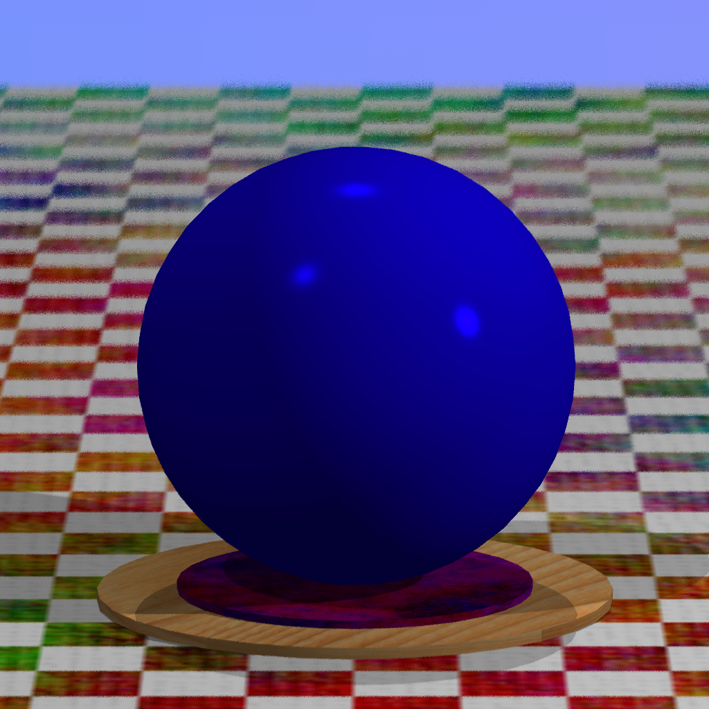

# Хрустальный шар с огнем

Зависимости:

    Необходимо в любом случае (для ubuntu)
    cmake
    libassimp-dev
    opencl-headers
    ocl-icd-opencl-dev
    clinfo
    
Нужна реализация OpenCL от вашего производителя видеокарты

    Для интегрированных видеокарт intel
    intel-opencl-icd

    Для Nvidia 
    nvidia-opencl-icd
    
    AMD
    mesa-opencl-icd

Команда clinfo покажет найденные платформы и устройства, для которых есть драйверы.

Не уверен, что пакеты указаны верно, сам запускал на manjaro с Intel Graphics, пакеты брал отсюда. https://wiki.archlinux.org/index.php/GPGPU

Сборка и запуск:

    cmake .
    make
    cd bin
    ./raytracer [options]

Необязательные опции запуска:

    -w <size>   установить размер картинки size x size, 512x512 по умолчанию
    -d <depth>  установить глубину рекурсии, 4 по умолчанию. Установка меньше 3 приведет к непрозрачности шара.
    -s <num>    установить число лучей на пиксель. По умолчанию 16.

Также в CMakeLists.txt есть закомментированный define SORT_RAYS, который теоретически может ускорить обработку на дискретных видеокартах. В случае intel - только замедляет:D

Последняя полученная картинка:
