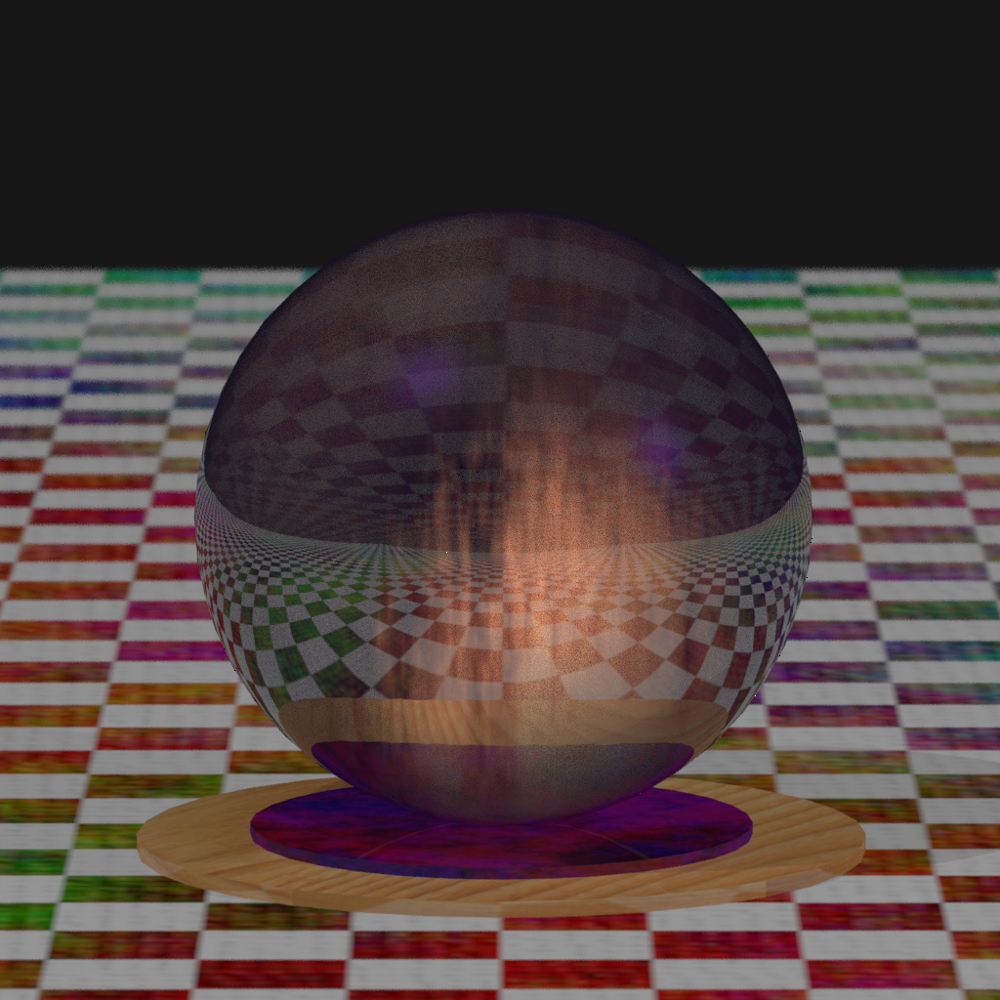

# Хрустальный шар с огнем

Зависимости:

    sudo apt-get install assimp

Нужна реализация OpenCL от вашего производителя видеокарты

Сборка и запуск:

    cmake .
    make
    cd bin
    ./raytracer

Последняя полученная картинка:
